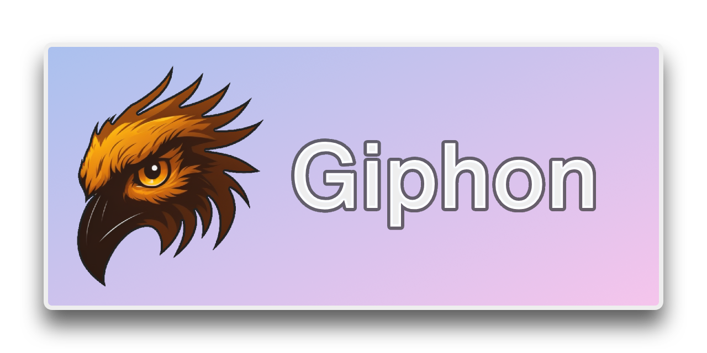

 [](https://pypi.org/project/black/) 
[](https://github.com/pypa/hatch)   

---

✨ Giphon is the contraction of 🦊 _Gitlab_ and 🫗 _siphon_. This CLI tools allows users
to recursively clone all projects in a given Gitlab group or instance.

## Motivation

This project aims to provide a tool capable of replicating a Gitlab group's
structure into a directory structure.

Locally cloned projects enable users to use familiar CLI tools such as `grep`
and `sed` directly into the projects' tree structure.

## Demo


## Installation

To install `giphon`, simply run:

```shq
pip install --user giphon
```

## Parameters

The `giphon` tool allows for the following parameters:

- **namespace** (CLI: `--namespace`): The Gitlab namespace to be cloned. `/`
  defaults to the whole instance.
- **output** (CLI: `--output`): The target path to clone the repositories to.
- **gitlab_token**: (CLI: `--gitlab-token`, env: `GITLAB_TOKEN`): The Personal
  Access Token authenticating the user.
- **gitlab_url**: (CLI: `--gitlab-url`, env: `GITLAB_URL`): The URL of the Gitlab
  instance to clone the repositories from. Defaults to `"https://gitlab.com"`
- **fetch_repositories**: (CLI: `--fetch-repositories`/`--no-fetch-repositories`):
  Whether to fetch remotes on repositories that already exist.
- **save_ci_variables**: (CLI: `--save-ci-variables`/`--no-save-ci-variables`):
  Whether to download CI/CD variables to a .env directory.
- **clone_archived** (CLI: `--clone-archived`/`--no-clone-archived`): Whether
  to also clone archived repository.
- **verbose**: (CLI: `--verbose`/`-v`): The level of verbosity

## Running programmatically

You can import the main function from `giphon` as such:

```python
from pathlib import Path

from giphon.siphon import siphon

siphon(
    namespace=Path("my-namespace"),
    output=Path("~/Projects"),
    gitlab_token="",
    gitlab_url="https://gitlab.com",
    fetch_repositories=True,
    save_ci_variables=False,
    clone_archived=False,
    verbose=False,
)
```

The function takes as inputs the same parameters from the CLI tool.

---

Logo is © from [**Midjourney**](https://midjourney.com)
